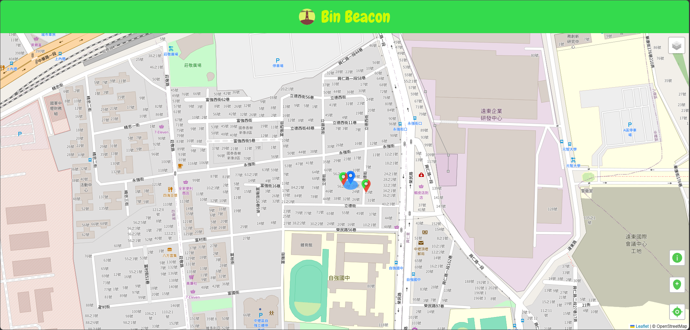
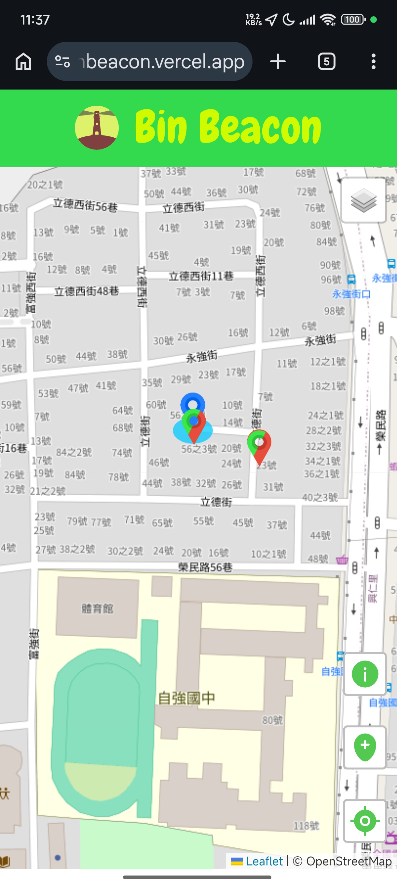
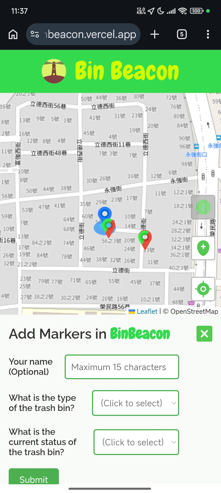
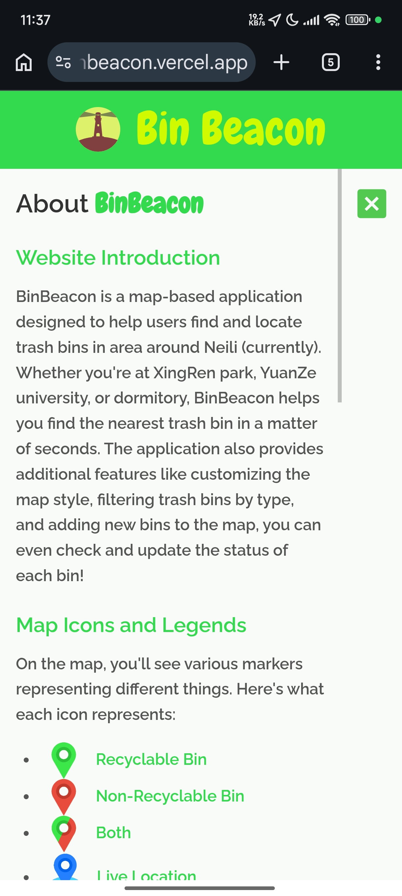
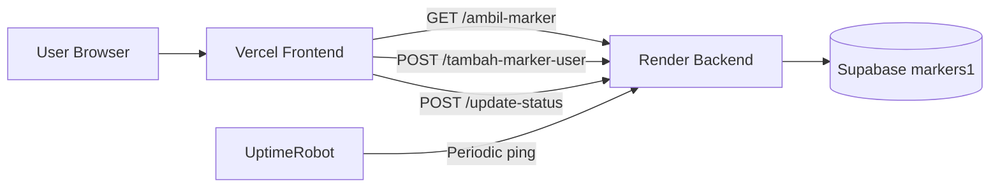

# BinBeacon

A personal web mapping project focused on a real local pain point: people often do not know where the nearest trash bin is, especially around campus and public spaces.

BinBeacon lets users discover nearby bins, contribute new bin locations, and update fill status in a shared live map.

[Live Frontend](https://binbeacon.vercel.app) • [Backend API](https://bin-beacon.onrender.com)

---

## Why We Built This

We wanted to build a practical project that combines geolocation, map UX, and cloud data syncing in a way that feels useful outside of class demos.

Main goals:

- Solve a real-world navigation problem
- Practice full-stack integration (frontend + API + database)
- Design an interface that encourages user contribution

---

## Project Highlights

- Real-time map interactions powered by Leaflet
- Live location marker with fallback center at Yuan Ze University
- Community-style marker submissions with optional author name
- Bin status workflow: Empty, Halfway, Full
- Multi-layer map controls (OSM + Stadia themes)
- Cloud-backed data with Supabase
- Reliability setup with cron + external uptime ping

---

## Product Walkthrough

<details>
<summary>1) Open map and locate current position</summary>

- On first load, the app requests geolocation
- If geolocation is slow, map starts from fallback center
- Once location is found, map recenters to the user

</details>

<details>
<summary>2) Explore existing bins</summary>

- Bins are fetched from API and rendered by type
- Different icons represent recyclable, non-recyclable, and combined bins
- Clicking a marker opens details and status controls

</details>

<details>
<summary>3) Add a new marker</summary>

- User selects bin type and current status
- Marker is submitted to backend and saved to Supabase
- Map reloads with the updated dataset

</details>

<details>
<summary>4) Update marker status</summary>

- Open any marker popup
- Select new status
- Submit to update the same coordinates in database

</details>

---

## Visual Showcase

Add your screenshots or GIFs in this section to make the repo portfolio-ready.

Recommended captures:

1. Landing view with user location marker
2. Marker legend/info panel
3. Add marker form flow
4. Updated marker status popup
5. Mobile view

Example markdown you can paste after adding images:




Mobile View




---

## Tech Stack

- Frontend: HTML, CSS, JavaScript, Leaflet
- Backend: Node.js, Express
- Database: Supabase (PostgreSQL)
- Hosting:
  - Frontend on Vercel
  - Backend on Render
- Uptime: UptimeRobot + backend cron task

---

## System Architecture



---

## Project Structure

```text
public/
	index.html
	css/style.css
	js/script.js
	js/classes.js
	images/
server/
	server.js
	markergetter.js
	resetStatus.js
	supabaseClient.js
package.json
```

---

## Local Setup

1. Install dependencies

```bash
npm install
```

2. Create .env in project root

```env
SUPABASE_URL=https://<your-project-id>.supabase.co
SUPABASE_KEY=<your-anon-key>
STADIA_API=<your-stadia-api-key>
PORT=3000
```

3. Run backend

```bash
npm run devStart
```

4. Serve frontend from public directory

- If using Live Server, set root to /public

---

## Database Schema (Supabase)

Table: markers1

| Column       | Type   | Description          |
| ------------ | ------ | -------------------- |
| id           | int8   | Primary key (auto)   |
| coordinate_x | float8 | Latitude             |
| coordinate_y | float8 | Longitude            |
| type         | text   | Rec, Nor, Two        |
| creator      | text   | Optional user name   |
| status       | text   | Empty, Halfway, Full |

---

## API Routes

| Method | Route               | Purpose               |
| ------ | ------------------- | --------------------- |
| GET    | /ambil-marker       | Get all markers       |
| GET    | /configsta          | Return map config key |
| POST   | /tambah-marker-user | Insert a new marker   |
| POST   | /update-status      | Update marker status  |

---

## Reliability Notes

- Backend cron performs periodic Supabase keep-alive checks
- UptimeRobot pings Render endpoint to reduce cold start and keep service warm

---

## Interactive Launch Checklist

- [ ] Supabase project created and active
- [ ] Table markers1 created with correct schema
- [ ] Render env vars set: SUPABASE_URL, SUPABASE_KEY, STADIA_API
- [ ] Render deployment healthy
- [ ] UptimeRobot monitor active
- [ ] Vercel frontend points to the current Render URL
- [ ] Add marker and update status tested on desktop and mobile

---

## Troubleshooting

<details>
<summary>Markers are not loading</summary>

- Check Render logs for fetch failed
- Verify SUPABASE_URL and SUPABASE_KEY values exactly
- Confirm Supabase project is not paused and table exists

</details>

<details>
<summary>Markers are not inserted</summary>

- Confirm table RLS/policies allow insert/update
- Verify frontend API URL in public/js/script.js
- Ensure page is not reloading before async request completes

</details>

<details>
<summary>Icons are broken in local development</summary>

- Ensure Live Server root is set to /public
- Restart Live Server after settings changes

</details>

---

## Future Improvements

- Marker clustering for dense areas
- Search and nearest-bin routing
- Auth for trusted status updates
- Admin moderation for duplicate or invalid markers
- Analytics dashboard for bin maintenance planning

---

## Author

Built as an IBPI student personal project.
